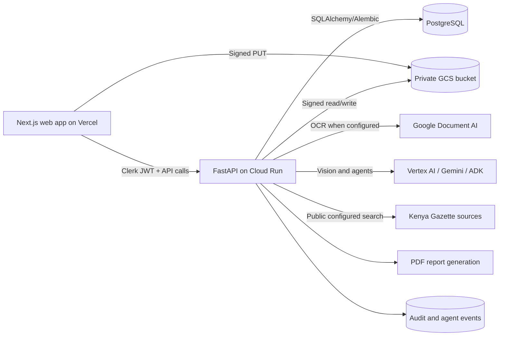

# Mradi wa Ardhi - Land Transaction Agent

Mradi wa Ardhi is an AI-assisted due-diligence workspace for Kenyan land transactions. A buyer or diligence team can create a case, upload private transaction documents, extract key facts, compare inconsistencies, search configured public Gazette sources, score transaction risk, request expert review, and generate a buyer-friendly PDF report before signing or releasing funds.

The system is intentionally conservative. It never claims official ownership verification unless an official integration returns evidence. Without an approved official registry, Ardhisasa, NLIMS, or partner API, results remain `not_verified_from_official_source`, `not_checked`, or `manual_review_required`.

## Production Posture

- Real Clerk JWT authentication in production, with development bypass rejected when `APP_ENV=production`.
- Case-level authorization for buyer data and role-gated admin routes.
- Private upload architecture using short-lived signed URLs, quarantine storage, SHA-256 checks, file signature validation, optional malware scanning, clean-file promotion, and short-lived authenticated reads.
- No storage keys, object paths, or public file URLs in normal API responses.
- Deterministic risk scoring with evidence, points, severity, recommendations, and persisted analysis versions.
- PDF reports with explicit legal safety language and stale-report checks before download.
- Structured JSON logs, audit logs, security headers, CORS restrictions, CSRF guard for cookie-authenticated unsafe requests, rate limiting, OpenTelemetry hooks, and optional Sentry.

## Architecture



Repository layout:

- `apps/web`: Next.js 16, React, TypeScript, Tailwind CSS, Clerk auth, Framer Motion, Lucide icons, reusable UI components, dashboard/report workflows.
- `apps/api`: FastAPI, SQLAlchemy, Alembic, PostgreSQL, Clerk JWT verification, signed uploads, file validation, extraction, ADK-style orchestration, risk scoring, reports, reviews, audit logs.
- `packages/contracts`: shared TypeScript enums and report/risk types.
- `docs`: deployment and production environment runbooks.
- `infra`: Cloud Run and Vercel deployment configuration.

Backend agents execute the chain:

`IntakeAgent -> VisionExtractionAgent -> ConsistencyAgent -> OfficialSearchAgent -> GazetteSearchAgent -> RiskScoringAgent -> ReportAgent -> LegalSafetyAgent`

Agent outputs are persisted to audit tables with prompt hashes, inputs, outputs, confidence, decisions, failures, and evidence references. Unavailable tools return transparent statuses instead of fabricated matches.

## What Needs Official Access

Independent ownership, national ID, KRA PIN, rates, rent, consent, POA, and registry status verification require lawful official APIs, approved data-sharing paths, or manual professional review. Uploaded search certificates are parsed as evidence, not treated as independent registry verification.

## Local Setup

Prerequisites:

- Node.js 20.9+
- pnpm 10+
- Python 3.12+
- PostgreSQL, or Docker for the included Compose database

Create local configuration:

```bash
cp .env.example .env
docker compose up -d postgres
```

Backend:

```bash
cd apps/api
python -m venv .venv
source .venv/bin/activate
pip install -e ".[dev,security]"
alembic upgrade head
python -m app.db.seed
uvicorn app.main:app --reload --host 0.0.0.0 --port 8000
```

Frontend:

```bash
pnpm install
pnpm --filter @mradi/web dev
```

Open `http://localhost:3000`.

For local development without Clerk, keep `AUTH_BYPASS=true`. Production must set `AUTH_BYPASS=false` and provide Clerk issuer/JWKS settings.

## Environment Variables

Use `.env.example` for local development and [docs/production-environment.md](docs/production-environment.md) for production. Required production groups:

- App URLs: `FRONTEND_URL`, `BACKEND_URL`, `CORS_ORIGINS`, `NEXT_PUBLIC_API_URL`
- Auth: `CLERK_ISSUER`, `CLERK_JWKS_URL`, optional `CLERK_AUDIENCE`, `AUTH_BYPASS=false`
- Secrets: `AUTH_SECRET` or strong `UPLOAD_SIGNING_SECRET` and `REPORT_SIGNING_SECRET`
- Database: `DATABASE_URL`, `AUTO_CREATE_TABLES=false`
- Storage: `STORAGE_BACKEND=gcs`, `GCS_BUCKET_NAME`, `GOOGLE_CLOUD_PROJECT`
- AI/OCR: `GOOGLE_GENAI_USE_VERTEXAI`, `VERTEX_AI_LOCATION`, `GEMINI_MODEL`, optional `DOCUMENT_AI_PROCESSOR_ID`
- Operations: `RATE_LIMIT_PER_MINUTE`, upload size limits, malware scanning settings, logs, OTLP, Sentry

Do not commit real secrets. Use Secret Manager for Cloud Run and Vercel environment variables for the web app.

## Core API Surface

Authenticated:

- `GET /auth/me`
- `GET|POST /cases`
- `GET|PATCH|DELETE /cases/{id}`
- `GET /cases/{id}/timeline`
- `GET /cases/{id}/documents`
- `POST /uploads/signed-url`
- `POST /uploads/complete`
- `POST /documents/{id}/extract`
- `GET /documents/{id}/read-url`
- `POST /documents/{id}/corrections`
- `DELETE /documents/{id}`
- `POST /api/cases/{id}/gazette-search`
- `POST /api/cases/{id}/risk-analysis`
- `POST /cases/{id}/analysis`
- `GET|POST /cases/{id}/report`
- `GET /cases/{id}/report.pdf`
- `GET|POST /reviews`
- `GET /audit-logs`
- `POST /pricing/selection`

Admin only:

- `GET /admin/users`
- `GET /admin/cases`
- `GET /admin/verification-attempts`
- `GET /audit-logs/admin`

Operational:

- `GET /healthz`
- `GET /health`
- `GET /readyz`

Signed local development transfer endpoints:

- `PUT /uploads/local/{document_id}`
- `GET /uploads/local-read`

These are token-bound signed URL endpoints used by the storage provider. They do not expose storage roots or persistent public object URLs.

## Deployment

Detailed runbooks:

- [Deployment guide](docs/deployment.md)
- [Production environment variables](docs/production-environment.md)

Production targets:

- Frontend: Vercel
- Backend: Google Cloud Run
- Database: Neon, Supabase Postgres, or Cloud SQL Postgres
- File storage: private Google Cloud Storage bucket
- AI: Vertex AI/Gemini and Document AI
- Agent runtime: backend ADK orchestration, with Vertex AI Agent Engine where supported by the organization release process

Frontend:

```bash
pnpm install --frozen-lockfile
pnpm --filter @mradi/web build
vercel --prod
```

Backend:

```bash
gcloud artifacts repositories create mradi --repository-format=docker --location=REGION
gcloud builds submit apps/api --tag REGION-docker.pkg.dev/PROJECT_ID/mradi/api:latest
gcloud run jobs execute mradi-api-migrate --region REGION --project PROJECT_ID --wait
gcloud run services replace infra/cloudrun-api.yaml --region REGION --project PROJECT_ID
```

Run Alembic migrations before routing production traffic. Grant the Cloud Run service account access to Postgres/Cloud SQL, GCS, Document AI, Vertex AI, Secret Manager, Cloud Logging, Cloud Trace, and IAM Credentials for GCS signed URLs.

Production smoke test:

```bash
curl -fsS "$BACKEND_URL/healthz"
curl -fsS "$BACKEND_URL/readyz"
curl -I "$FRONTEND_URL"
```

## Quality Checks

```bash
pnpm --filter @mradi/web lint
pnpm --filter @mradi/web typecheck
pnpm --filter @mradi/web test
pnpm --filter @mradi/web e2e
pnpm --filter @mradi/web build

cd apps/api
.venv/bin/ruff check app tests
.venv/bin/mypy app
.venv/bin/pytest
```

## Security Notes

- Keep buckets private with uniform bucket-level access. Do not serve uploaded documents through the web app public directory or public object ACLs.
- Keep `PERSIST_RAW_EXTRACTION_PAYLOADS=false` unless a controlled investigation requires temporary raw payload retention.
- Enable malware scanning with reachable ClamAV infrastructure before treating the scanner as active.
- Use shared rate limiting such as Redis for multi-instance production. The included middleware is process-local.
- Keep PDF downloads authenticated and reject stale report downloads until regeneration.
- Treat reports, extracted fields, snippets, and audit events as confidential case data.

See [SECURITY.md](SECURITY.md) for threat model, controls, limitations, and responsible disclosure guidance.

## Known Limitations

- The app is decision support, not legal advice and not a licensed advocate, surveyor, valuer, bank, SACCO, Ministry of Lands, National Land Commission, or registry verification service.
- Automated Gazette search depends on configured public-source availability and can fail or miss records.
- Document AI, Gemini, and Vertex AI features require configured Google Cloud access.
- Local storage is for development only. Production startup rejects non-GCS storage.
- In-memory rate limiting is not sufficient for horizontally scaled production.
- Payment selection is recorded, but live payment processing is not wired in this codebase.

## Extending The System

- Add an official verification source by implementing an adapter returning `VerificationResult` with a supported `VerificationStatus`.
- Add document fields in `apps/api/app/services/extraction.py`, then expose the field in the extraction review UI.
- Adjust risk weights in `RISK_DEFINITIONS`; keep every score evidence-backed and auditable.
- Add reviewer workflows by extending `ReviewRequest` status transitions and creating reviewer-specific Clerk roles.
- Add billing by connecting the pricing selection route to a payment provider while preserving audit events.
